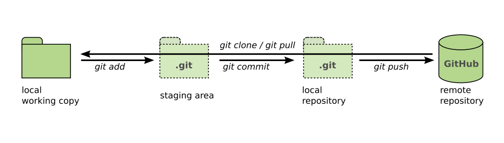

# Versionskontrolle mit Git

Dies ist ein kurzes Tutorial in die Versionskontrolle mit [Git](https://git-scm.com/).

## Warum brauchen wir Versionskontrolle?

Lies die Geschichte:

*Ada schreibt das Programm `hello.py`.*
*Etwas später ändert sie das Programm und speichert die Änderungen in der Datei `hello2.py`.*
*Sie schickt die Datei als e-Mail an Bon, der den Code ebenfalls ändert. Er schickt die Datei `hello_new_version.py` zurück an Ada.*
*In der Zwischenzeit hat Ada ihre Version des Programms verbessert und als `hello3.py` gespeichert.*
*Sie geht ihren Code Zeile für Zeile durch, um Bobs Änderungen einzubauen und erhält die Datei `hello3_with_bob.py`.*
*Später findet Bob heraus, dass die ursprüngliche Datei `hello2.py` einen Fehler enthielt.*
*Ada und Bob setzen sich zusammen und versuchen herauszufinden, was sie reparieren müssen.*

**Was für Schwierigkeiten könnten Ada und Bob mit ihrer Vorgehensweise bekommen?**

siehe auch [PhD Comic 1531](https://phdcomics.com/comics/archive_print.php?comicid=1531)

## Was ist Versionskontrolle?

**Versionskontrolle ist eine Kombination aus Logbuch und Zeitmaschine für Programmcode.**

Ein System zur Versionskontrolle protokolliert automatisch *Änderungen* in Deinem Programmcode und anderen Dateien im Projekt. du kannst dadurch:

* Ideen ausprobieren, ohne Das Programm kaputt zu machen.
* im Team parallel an einem Projekt arbeiten.
* Zu früheren Versionen und wieder zurück springen.
* Dein Projekt über [GitHub](http://www.github.com) veröffentlichen.

Versionskontrolle ist unumgänglich, um professionell Programme zu entwickeln.

## Überblick

Git ist ein Programm, das beim Programmieren die **Zusammenarbeit** erleichtert. **Änderungen** am Code werden in einem **Repository** gespeichert. mit den **Git Kommandos** können beliebige **Versionen** des Codes inspiziert und abgerufen werden. Git ermöglicht die Entwicklung in mehreren **Branches** und wird von zahlreichen **Tools** wie GitHub unterstützt.

Git kennt mehrere Orte, an denen Dateien gespeichert sein können:

- die **lokalen Arbeitskopie** sind normale Verzeichnisse, in denen Du Code editierst
- im **lokalen Repository** bewahrt Git die gesamte Historie aller Dateien im Projekt auf. Es ist etwas versteckt aber auf deinem Computer.
- das **entfernte (remote) Repository** befindet sich auf einem anderen Computer im Internet.

Viele Git Kommandos bewegen Änderungen zwischen diesen Orten hin und her.

## Übung: Veröffentliche ein Programm auf GitHub

In dieser Übung verwendest du Git, um ein Programm veröffentlichen.
Git ist ein Programm für die **Kommandozeile**.
Du solltest also in der Lage sein, Dich ein wenig in einem Kommandozeilenterminal zurechtzufinden.

### Aufgabe 1: Installiere Git

Folge der [Installationsanleitung für dein Betriebssystem](https://www.python4data.science/de/latest/productive/git/install-config.html), um Git auf deinem Computer zu installieren.

Am Ende solltest Du in der Lage sein, in der Kommandozeile folgenden Befehl einzugeben:

    git --help

Du solltest etwa eine Bildschirmseite Anleitungstext erhalten, die mit den Worten `usage: git` beginnt.

### Aufgabe 2: Erstelle ein GitHub-Projekt

* Lege ein Konto auf [GitHub](https://github.com/) an
* Erstelle dort ein neues Repository
* Gib dem Repository einen Namen und eine kurze Beschreibung
* Erstelle eine `README.md`-Datei (*optional*)
* Wähle die MIT-Lizenz aus (*optional*)

### Aufgabe 3: Erstelle eine lokale Arbeitskopie

* Gehe auf die Startseite Deines GitHub-Projekts
* Finde den grünen Knopf mit der Aufschrift **<> Code** (grün)
* Drücke darauf und kopiere die **HTTPS URL** des Projekts
* Öffne ein Kommandozeilenterminal
* Wechsle mit `cd` in das Verzeichnis, an dem das Projekt liegen soll (z.B. Desktop)
* Gib ein `git clone URL` und füge statt URL die kopierte Adresse ein

Es sollte ein neues Verzeichnis mit dem Namen deines Projekts entstehen.

### Aufgabe 4: Dateien hinzufügen

* Erstelle eine Textdatei `hello.py` in das neue Projektverzeichnis
* Schreibe den Befehl `print("hello world")` in die Datei und speichere sie ab
* Gib `git status` ein
* Stelle die Datei mit `git add hello py` unter Versionskontrolle
* Gib `git status` ein
* Speichere die Änderungen mit `git commit -m "hello world Programm geschrieben"` in das lokale Repository
* Gib `git status` ein

### Aufgabe 5: Änderungen veröffentlichen

Nun kannst du alle Änderungen auf GitHub mit `git push` veröffentlichen.

Beim ersten Mal wünscht sich `git`, dass du Name und E-Mail konfigurierst.
Gib die angezeigten `git config ..`-Befehle ein oder folge den [Anweisungen im Abschnitt 'Konfiguration'](https://www.python4data.science/de/latest/productive/git/install-config.html).
Versuche `git push` dann erneut.

Aktualisiere die Webseite des Projekts im Browser.
Du solltest dort die Datei `hello.py` sehen.

### Aufgabe 6: Dateien ignorieren

Viele Dateien haben in einem öffentlichen Repository nichts zu suchen: *persönliche Daten, Passwörter, aber auch automatisch generierte Dateien wie `__pycache__` und `.jupyter-checkpoints/`.

Wenn du eine Datei namens `hello.pyc` hinzufügst, wird diese von `git status` angezeigt.
Hier weist Du `git` an, diese zu ignorieren.

* Suche Dir auf [https://github.com/github/gitignore](https://github.com/github/gitignore) eine passende Datei für Deine Programmiersprache.
* Speichere den Inhalt im Projektverzeichnis in einer Datei namens `.gitignore`.
* Füge die Änderungen mit `git add` und `git commit` wie oben hinzu.
* In die Datei `.gitignore` kannst Du auch von Hand Namen Dateien und Verzeichnissen eintragen (ein Dateiname pro Zeile).

Nun sollte `git status` nichts mehr anzeigen.

### Aufgabe 7: Datenschutz

* Prüfe, ob sich im Projekt urheberrechtlich geschütztes Material oder persönliche Daten befinden
* Ergänze eventuelle Lizenzbestimmungen oder Namensnennungen in der README.md-Datei
* Mit `git rm DATEINAME` und `git commit` kannst Du Dateien ohne Nutzungsrechte löschen.

### Aufgabe 8: Zeitreise

* Zeige mit `git log` die Geschichte des Projekts an.
* Jeder Eintrag hat einen Buchstabencode (hash), z.B. `276fde136c067c5c622ec03ea1b0b..`
* Mit `git reset HASH` kannst Du zu einer früheren Version springen.
* Mit `git reset main` kommst Du wieder in die Gegenwart.

### Aufgabe 9: Kollaboration

Entwickle dein Projekt im Zweierteam weiter.

* Füge auf der Webseite unter **Settings -> Collaborators** eine zweite Autorin hinzu
* Mit `git clone` kann diese sich eine Kopie des Projekts besorgen wie oben beschrieben
* Wenn ihr Dateien ändert, müßt ihr die Änderungen jedes Mal mit `git add` und `git commit` einchecken.
* Mit `git push` könnt ihr eure Änderungen hochladen
* Mit `git pull` könnt ihr die aktuellste öffentliche Version des Codes anfordern

Fügt abwechselnd neue Dateien zum Repository hinzu.

### Aufgabe 10: Konflikte

Wenn ihr beide die gleiche Stelle in der gleichen Datei ändert, meldet `git pull` einen Konflikt.
Diesen müßt Ihr von Hand auflösen.
Editiert dazu die von `git status` als *merge conflict* angezeigte Datei.

In der Datei befinden sich Markierungen, die anzeigen, was von wem geschrieben wurde.
Entscheidet welche Teile ihr behalten möchtet und löscht die Markierungen.

Gebt anschließend wieder `git add` und `git commit` ein.

Wenn sich alle Änderungen mit `git push` hochladen lassen und das Programm noch funktioniert, habt ihr es richtig gemacht.

## Typische Probleme

#### git status funktioniert nicht!

Vermutlich ist dein Terminal gar nicht in einem Verzeichnis unter Versionskontrolle.
Wenn du gerade `git clone` ausgeführt hast, musst du danach unbedingt `cd meinprojektname/` eingeben, um im Projektverzeichnis zu landen.

#### git push funktioniert nicht!

Gib erst einmal ``git status`` ein und lies die Ausgabe aufmerksam.
Häufige Ursachen sind:

- du hast überhaupt noch nichts committet
- auf GitHub befinden sich andere Commits als bei dir. Führe zunächst `git pull` aus

#### git pull funktioniert nicht!

Gib erst einmal ``git status`` ein und lies die Ausgabe aufmerksam.
Häufige Ursachen sind:

- du hast noch nicht alle Änderungen committet. Führe ganz in Ruhe `git add` und `git commit` aus.
- es besteht ein merge Konflikt, den du auflösen musst
- es gibt gar keine neuen Änderungen

#### Ich stecke in einem seltsamen Editor fest!

Falls du bei `git commit` das `-m` und den Logbucheintrag vergisst und in einem komischen Editor landest, kannst Du diesen mit `ESCAPE` und `:q!` wieder verlassen.

#### Ich glaube ich habe meine Arbeitskopie kaputt gemacht. Was jetzt?

Das ist nicht schlimm. Git soll ja gerade verhindern, dass etwas verloren geht.
Eine sichere Rettungsstrategie ist:

- erstelle eine Sicherheitskopie der gesamten Arbeitskopie
- gehe in ein anderes Verzeichnis, z.B. Desktop/
- erstelle eine neue Arbeitskopie mit `git clone`
- kopiere alles was du brauchst aus der Sicherheitskopie in die neue Arbeitskopie

#### Mein Problem ist hier nicht aufgeführt!

Schaue auf [First Aid Git](https://firstaidgit.io) nach.

## Wiederholungsfragen

- Warum ist es besser, Git anstelle von GoogleDrive zu verwenden?
- Was für Vorteile hat Git in einem ein-Personen-Projekt?
- Was für Dateien sollten nicht in einem Git-Repositorium sein?
- Wie kannst du herausfinden, ob das aktuelle Verzeichnis zu einem Repository gehört?

## Links

* [Git Tutorial in Python4DataScience](https://www.python4data.science/de/latest/productive/git/index.html)
* [Git Dokumentation](https://book.git-scm.com/doc)
* [Try GitHub - online-Tutorial](https://try.github.io/)
* [Learn Git auf Codecademy](https://www.codecademy.com/learn/learn-git)
* [Introduction to Git and GitHub](https://realpython.com/python-git-github-intro/) von Jim Anderson
* [Adding SSH keys to your GitHub account](https://help.github.com/articles/adding-a-new-ssh-key-to-your-github-account/)
